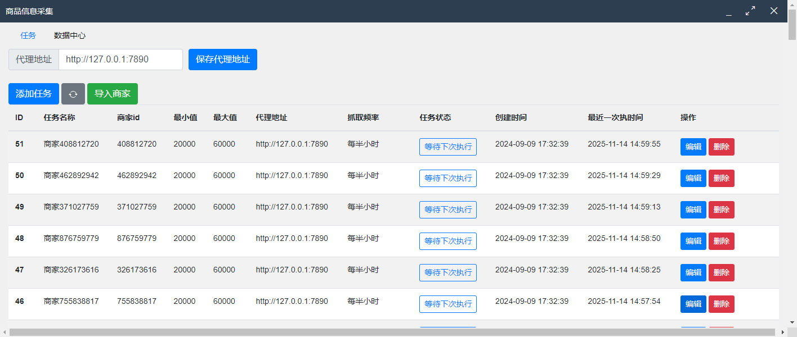
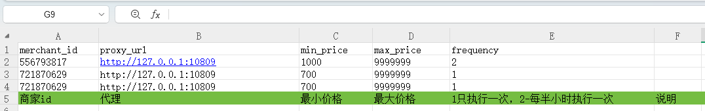
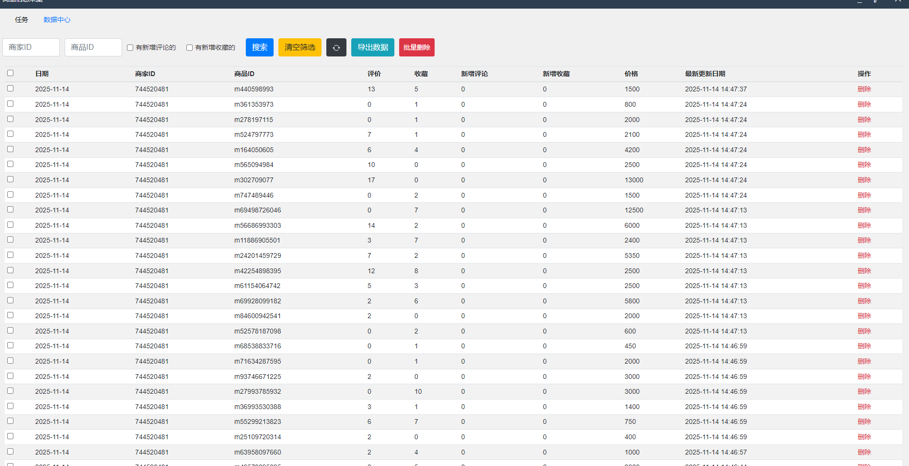
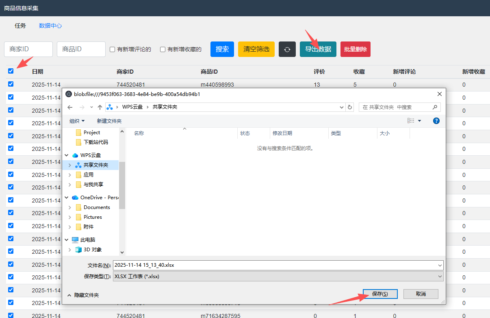
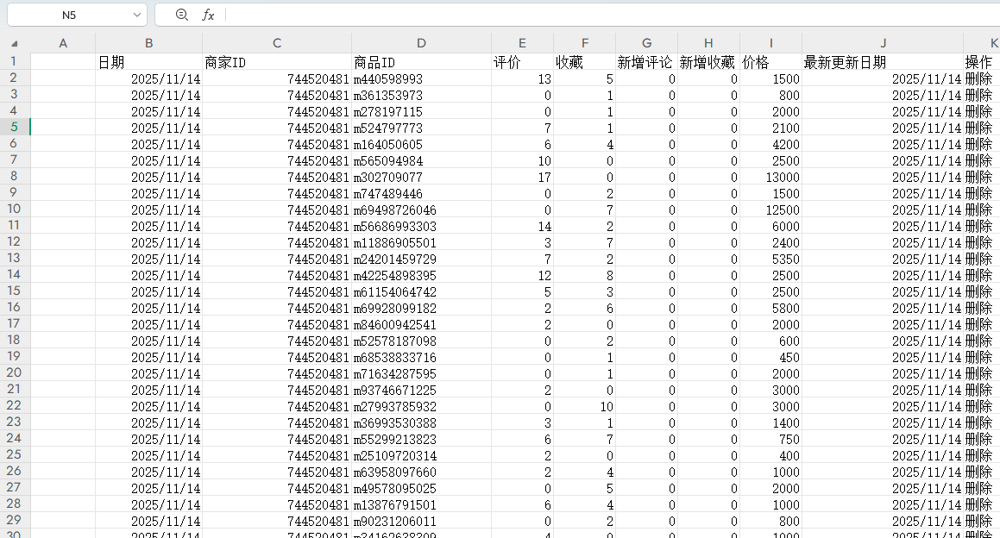

# 分享说明：
去年开发的一个小工具，有空分享下，仅用于技术交流。请勿用作非法用途。
# 项目需求：
采集自家煤炉账号的商品信息。
# 本地测试
```
npm install

npm srart
```

# 打包程序
```
electron-packager . MyApp --platform=win32 --arch=x64
```
# 代码中的debug 在测试的时候要改为true，打包的时候要改成false否则读取配置文件会有问题
```
// 打包的时候需要是false，否则配置文件读取不到
const debug = false
```

### 支持添加导入商家信息

#### 导入模板：

#### 爬取的信息记录：

#### 支持导出：

